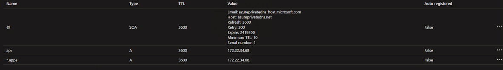

# Deploy a Private Azure Openshift (ARO) Cluster

This document describes the steps involved to deploy a private Azure OpenShift (ARO), the managed service in Azure, to an existing virtual network using a custom DNS server. The deployment option is more secure and more closely aligned with the typical production environments as compared to the deployment for a public OpenShift cluster. However, it also brings more complexity before, during and post deployment.

The purpose of the document is to provide step by step instructions for the deployment in one place, with references to official documentation.

## Prerequisites

It is assumed that you have the following assets available prior to the deployment.

- a user account and a service principal with proper permissions in an Azure subscription
- an existing virtual network (vnet), two subnets for master nodes and worker nodes, and a routing table
- a resource group for the OpenShift cluster in Azure. This resource group may be the same or different from the resource group where the vnet is located.

For minimum networking requirements, including vnet and subnets IP address ranges or CIDRs, check [Networking for Azure Red Hat OpenShift](https://learn.microsoft.com/en-us/azure/openshift/concepts-networking#networking-for-azure-red-hat-openshift)

## Role Assignments or Permissions

For role assignments or permissions, verify that you have the following:

- role assignments of "Contributor" and "Use Access Administrator" to the service principal to the OpenShift cluster resource group (or subscription if applicable to simplify the task, especially for dev/test environments).
- role assignments of "Use Access Administrator" to the vnet resource group if it is different from the OpenShift cluster resource group.
- no role assignment of "Network Contributor" to the vnet resource group to the service principal and to the built-in managed identity, "Azure Red Hat OpenShift RP" (OpenShift resource provider). Remove the role assignments if they exist. They will be created during deployment and can result in deployment conflict or failure if they pre-exist.
- role assignment of "Network Contributor" to the routing table to the service principal and to the managed identity, "Azure Red Hat OpenShift RP". The deployment will fail if the role assignments are missing. Note that the routing table may be in its own resource group, separate from that for the OpenShift cluster and the vnet.

For more info on permissions, check the [Azure documentation](https://learn.microsoft.com/en-us/azure/openshift/tutorial-create-cluster#verify-your-permissions).

You can verify and complete the role assignments through the Azure portal. Or, you can run the cli commands.

```
az login

az account set --subscription xxx

# Register resource providers
az provider register -n Microsoft.RedHatOpenShift --wait
az provider register -n Microsoft.Compute --wait
az provider register -n Microsoft.Storage --wait
az provider register -n Microsoft.Authorization --wait

RESOURCEGROUP_vnet=xxx # OpenShift cluster
LOCATION=e.g. eastus  # the location of the new cluster 
DOMAIN=xxx # the domain prefix for the cluster, e.g. poc 
ARO_CLUSTER_NAME=xxx # the name of the cluster. It is not part of the OpenShift URL but can be used to reference the cluster

aro-vnet=xxx
master-subnet=xxx
worker-subnet=xxx

SP_CLIENT_ID=xxx
SP_CLIENT_SECRET=xxx

PULL_SECRET=$(cat pull-secret.txt)    # Red Hat pull secret text

# Create resource group for OpenShift
#az group create --name $RESOURCEGROUP --location $LOCATION

#Create a service principal for the new Azure AD application
az ad sp create-for-rbac --name "sp-$RG_NAME-${RANDOM}" > app-service-principal.json SP_CLIENT_ID=$(jq -r '.appId' app-service-principal.json) 
SP_CLIENT_SECRET=$(jq -r '.password' app-service-principal.json) 
SP_OBJECT_ID=$(az ad sp show --id $SP_CLIENT_ID | jq -r '.id')

#Use an existing service principal
SP_OBJECT_ID=$(az ad sp show --id $SP_CLIENT_ID | jq -r '.id')

#Find object id for "Azure Red Hat OpenShift RP resource provider
ARO_RP_SP_OBJECT_ID=$(az ad sp list --display-name "Azure Red Hat OpenShift RP" --query [0].id -o tsv)

# remove network contributor role in the vnet resource group
az role assignment delete --assignee $SP_OBJECT_ID  --role "Network Contributor"
az role assignment delete --assignee $ARO_RP_SP_OBJECT_ID --role "Network Contributor"

#assign permissions to the service principal to the vnet resource group
#az role assignment create  --role 'Contributor'  --assignee-object-id $SP_OBJECT_ID  --resource-group $RESOURCEGROUP  --assignee-principal-type 'ServicePrincipal'
#az role assignment create  --role 'User Access Administrator'  --assignee-object-id $SP_OBJECT_ID  --resource-group $RESOURCEGROUP  --assignee-principal-type 'ServicePrincipal'

#Add permissions to the routing table if using existing vnet
#Find the resource ip (scope) from the portal e.g. /subscriptions/subid/resourceGroups/rg1/providers/Microsoft.Network/routeTables/testrt/routes/route1
#az role assignment create  --role 'Network Contributor'  --assignee-object-id $SP_OBJECT_ID  --scope <resourceid here> --assignee-principal-type 'ServicePrincipal'
#az role assignment create  --role 'Network Contributor'  --assignee-object-id $ARO_RP_SP_OBJECT_ID  --scope <resourceid here> --assignee-principal-type 'ServicePrincipal'
```

## Deploy a Private OpenShift Cluster

You can deploy the OpenShift cluster using one of the options. The Azure portal provides an intuitive, wizard style user interface but it does not provide as many customization option as the other two options.

- [Azure portal](https://learn.microsoft.com/en-us/azure/openshift/quickstart-portal), or 
- [ARM template or Bicep file](https://learn.microsoft.com/en-us/azure/openshift/quickstart-openshift-arm-bicep-template?pivots=aro-bicep), or via 
- [az aro create](https://learn.microsoft.com/en-us/cli/azure/aro?view=azure-cli-latest) cli command lines. 

The cli command looks much succinct with defined variables. Note that no "=" operator is used.
```
az aro create  --resource-group $RESOURCEGROUP --location=$LOCATION --name $CLUSTER --ingress-visibility Private --domain $DOMAIN --worker-count 5 --vnet $aro-vnet --master-subnet $master-subnet --worker-subnet $worker-subnet  --client-id  $SP_CLIENT_ID --client-secret $SP_CLIENT_SECRET --client-secret=$SP_CLIENT_SECRET  
```

It's worth noting that there are recommended configurations for small, medium and large clusters to support applications such as IBM [Maximo Application Suite](https://azuremarketplace.microsoft.com/en-us/marketplace/apps/ibm-usa-ny-armonk-hq-6275750-ibmcloud-asperia.ibm-maximo-application-suite-byol?tab=overview). 

```
Supported cluster sizes:
* Small: Master Nodes (Standard_D8s_v3 x 3) - vCPU:24 Memory:96GB | Worker Nodes (Standard_D16s_v3 x 3) - vCPU:48 Memory:192GB | Bootnode (Standard_D2s_v3 x 1) - vCPU:2 Memory:8GB
* Medium: Master Nodes (Standard_D8s_v3 x 3) - vCPU:24 Memory:96GB | Worker Nodes (Standard_D16s_v3 x 5) - vCPU:80 Memory:320GB | Bootnode (Standard_D2s_v3 x 1) - vCPU:2 Memory:8GB
* Large: Master Nodes (Standard_D8s_v3 x 5) - vCPU:40 Memory:160GB | Worker Nodes (Standard_D16s_v3 x 7) - vCPU:112 Memory:448GB | Bootnode (Standard_D2s_v3 x 1) - vCPU:2 Memory:8GB
```

Similarly, there are minimum CPU and memory requirements if Red Hat [OpenShift Data Foundation (ODF)](https://access.redhat.com/documentation/en-us/red_hat_openshift_data_foundation/4.10/html-single/planning_your_deployment/index#resource-requirements_rhodf) is required.

| Deployment Mode   | Base services     | Additional device Set |
| ----------------- | ----------------- | --------------------- |
| Internal          | 30 CPU (logical)  | 6 CPU (logical)       |
|| 72 GiB memory     | 15 GiB memory     |
|| 3 storage devices | 3 storage devices |
| External          | 4 CPU (logical)   | Not applicable        |
|| 16 GiB memory     |

### What is a Private Cluster

When "API server visibility" and "Ingress visibility" are set to "private", the OpenShift cluster is only accessible from the internal networks including the vnet or peered vnet. However, the public IP address is still provisioned for egress traffic. For more details on the networking architecture, check [Network concepts for Azure Red Hat OpenShift](https://learn.microsoft.com/en-us/azure/openshift/concepts-networking).


To create a private cluster without the public IP address, use the [UserDefinedRouting flag](https://learn.microsoft.com/en-us/azure/openshift/howto-create-private-cluster-4x), which is in technology preview.

### Red Hat Pull Secret

It's worth noting that Red Hat pull-secret is optional for OpenShift deployment and that you can [add or update the pull secret](https://learn.microsoft.com/en-us/azure/openshift/howto-add-update-pull-secret) post deployment. 

However, it is highly recommend that you include it during the deployment whenever possible. It helps save time because the OpenShift admin console provides a read-only option and that you will have to download and revise the json file, run the `oc` command to apply the change, and modify the configuration files. Also, rebooting the OpenShift may be required.

If you deploy the OpenShift cluster without supplying a valid Red Hat pull secret, none of the OpenShift operators are visible in OperatorHub.


### Obtain OpenShift Cluster Admin Credentials

Before logging in to the OpenShift cluster, you'll need to find the administrator's credentials, user name "kubeadmin" and password. Use the CLI command below. Check [Connect to an Azure Red Hat OpenShift 4 cluster](https://learn.microsoft.com/en-us/azure/openshift/tutorial-connect-cluster#connect-to-the-cluster) for more details

```
az aro list-credentials --name $CLUSTER --resource-group $RESOURCEGROUP
```

### Use Azure Active Directory Authentication for OpenShift

By default, kubeadmin and password are used to log in to the OpenShift cluster. However, you can configure OpenID for the OpenShift cluster and log in through Azure Active Directory. Check [Configure Azure Active Directory authentication for an Azure Red Hat OpenShift 4 cluster](https://learn.microsoft.com/en-us/azure/openshift/configure-azure-ad-ui) for more details.

## OpenShift Cluster and New ARO Resource Group

Upon a successful deployment, you will find one entry for the OpenShift cluster resource in the specified resource group. 

Click the link to open the resource, where you will see the OpenShift cluster name, along with the following properties.
- OpenShift console URL, e.g. "console-openshift-console.apps.domainxxx.westus.aroapp.io"
- cluster version e.g. "4.10.40"
- API Server Visibility, e.g. private
- API Server URL, e.g. "api.doaminxxx.westus.aroapp.io:6443"

Also, you will find a new resource group named as "aro-infra-clustername". For the medium cluster with 3 master nodes and 5 worker nodes, there are 34 resources, including VMs and disks for master nodes and worker nodes, public and internal load balancers, network interfaces, and one network security group (nsg) with 3 default rules each for inbound traffic and outbound traffic.

If the deployment fails, there may be fewer or more resources. In the medium cluster deployment, we've seen 37 resources, including a VM, a disk and a network interface for the Bastion machine. These resources are removed automatically for successful deployments.

Make a note of the internal load balancer IP for use later. Note that the IP address is the same as that for "api" and the cluster.


## Custom DNS Server

Azure provides an option to use a custom DNS server. If the DNS server is configured prior to the deployment, no further action required. Otherwise, you will need to [configure the DNS server](https://learn.microsoft.com/en-us/azure/openshift/howto-custom-dns) and reboot the cluster.

On your customer DNS server, create a conditional forwarder so that all traffic going to *.aroapp.io are forwarded to Microsoft using the virtual public IP address, [168.63.129.16](https://learn.microsoft.com/en-us/azure/virtual-network/what-is-ip-address-168-63-129-16).


### Rebooting OpenShift cluster

While Red Hat provides detailed documentation on how to shutdown and restart the cluster, it is suggested that you refer to the documentation on Microsoft Azure. There seems no individual document on the topic but you can follow the instructions on the segment of [Gracefully reboot your cluster](https://learn.microsoft.com/en-us/azure/openshift/howto-custom-dns#gracefully-reboot-your-cluster).

Rebooting the cluster takes a few minutes normally. However, we've seen the process taking more than one hour.

## Create a Private DNS Zone

Use [Azure portal](https://learn.microsoft.com/en-us/azure/dns/private-dns-getstarted-portal) or CLI command to create a private DNS zone. Name the private zone to match your OpenShift cluster name, e.g. "domainxxx.aroapp.io".

Link the vnet for your OpenShift cluster. Name the link something you like or something conforming to your naming rules.

Add two A records, one for "*.apps" and one for "api". Use the IP address of the internal load balancer.



## Troubleshooting 

### nslookup

Use the nslookup tool to ensure that api and the cluster admin console are resolved to the IP address of the internal load balancer. For the cluster admin console, the resolved ip address may end up with ".254", which is the [ingress controller](https://learn.microsoft.com/en-us/azure/openshift/howto-secure-openshift-with-front-door).

### Pod IP address conflict with external services

The default [Pod CIDR](https://learn.microsoft.com/en-us/azure/openshift/concepts-networking#networking-for-azure-red-hat-openshift) is 10.128.0.0/14. Per [Red Hat documentation](https://docs.openshift.com/dedicated/networking/cidr-range-definitions.html), the address block must not overlap with any external service accessed from within the cluster. 

When the Pod IP address range overlaps with internal IP address space, as we've seen in practice, users with conflicting private IP addresses cannot access the OpenShift cluster. This is because the requests are redirected to and treated as the internal communications of the cluster.

## Contributors

Many thanks to my colleague, Jonathan Rossi, who helped review the doc and provided constructive comments.